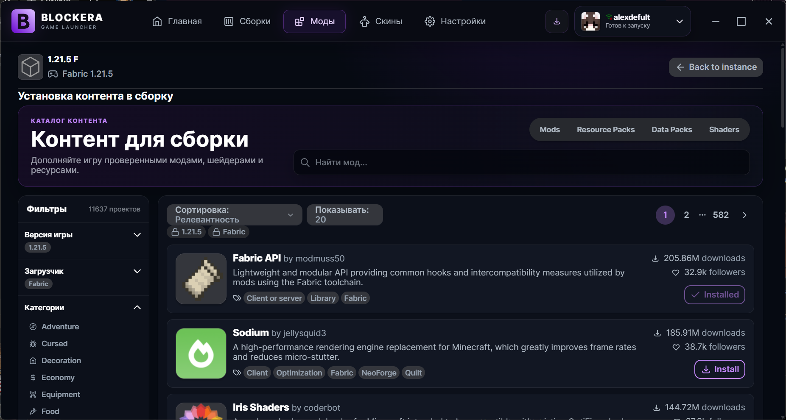
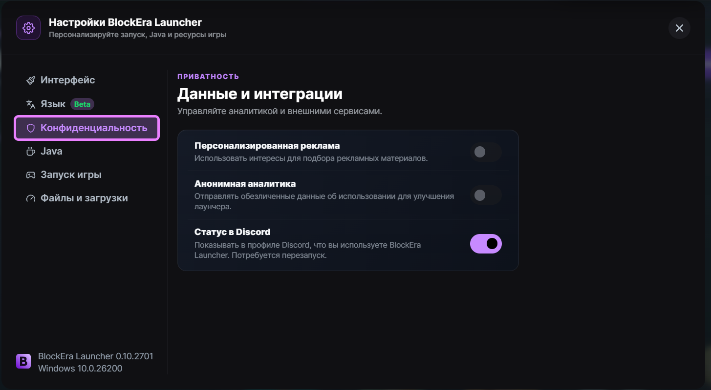
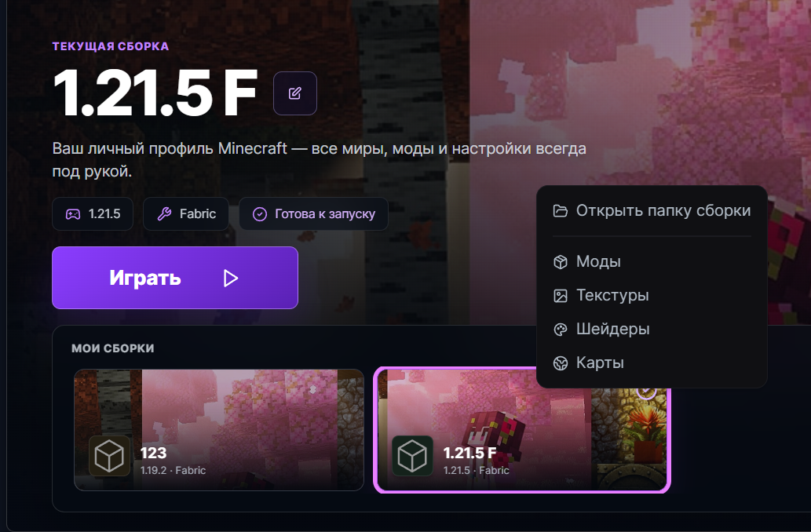

<div align="center">
  

# BlockEra Launcher

**Современный Minecraft-лаунчер для сборок, модов и персонализации игры.**

[](https://github.com/dw1rf/BlockEra-Launcher/releases/latest)
[](https://github.com/dw1rf/BlockEra-Launcher/releases)
[](https://github.com/dw1rf/BlockEra-Launcher/releases/latest)
[](COPYING.md)

### [⬇ Скачать BlockEra Launcher Setup.exe](https://github.com/dw1rf/BlockEra-Launcher/releases)

[Все релизы](https://github.com/dw1rf/BlockEra-Launcher/releases) · [Сообщить об ошибке](https://github.com/dw1rf/BlockEra-Launcher/issues/new) · [Предложить функцию](https://github.com/dw1rf/BlockEra-Launcher/discussions)

</div>

---

## Возможности

- **Сборки в одном месте** — Fabric, Forge, NeoForge, Quilt и Vanilla.
- **Каталог контента** — установка модов, текстур, шейдеров и датапаков прямо в выбранную сборку.
- **Быстрые действия** — настройки, ремонт, экспорт и открытие нужных папок по правому клику.
- **Аккаунты** — Microsoft, Ely.by и локальные offline-профили.
- **Offline-скины** — отдельные скины Classic/Slim для каждого локального аккаунта.
- **Управление Java** — автоматический подбор и загрузка подходящей версии среды.
- **Приватность** — аналитика и персонализированная реклама выключены по умолчанию.
- **Подписанные обновления** — проверка и установка новых версий через GitHub Releases.

## Интерфейс

### Каталог модов выбранной сборки



<table>
  <tr>
    <td width="50%"></td>
    <td width="50%"></td>
  </tr>
  <tr>
    <td align="center"><b>Настройки лаунчера</b></td>
    <td align="center"><b>Действия со сборкой</b></td>
  </tr>
</table>

## Установка

1. Скачайте **BlockEra.Launcher.Setup.exe** со страницы [последнего релиза](https://github.com/dw1rf/BlockEra-Launcher/releases/latest).
2. Запустите установщик и завершите установку для текущего пользователя.
3. Откройте BlockEra Launcher и добавьте аккаунт.

> Windows SmartScreen может показать предупреждение, пока установщик не подписан коммерческим EV/OV-сертификатом. Файлы автообновлений при этом защищены отдельной криптографической подписью Tauri.

## Автообновления без backend

Отдельный сервер не нужен. GitHub Releases хранит `setup.exe`, файл `latest.json` и подпись обновления. Лаунчер автоматически проверяет последний релиз, но устанавливает его только после действия пользователя.

Релизы собираются workflow-файлом [`.github/workflows/release.yml`](.github/workflows/release.yml). Подробная инструкция находится в [`docs/RELEASING.md`](docs/RELEASING.md).

## Разработка

Требуются Node.js из `.nvmrc`, pnpm 9, Rust stable, Java 17 и зависимости Tauri для вашей ОС.

```bash
pnpm install
pnpm --filter=@modrinth/app-frontend run tsc:check
pnpm --filter=@modrinth/app run tauri dev
```

Production installer для Windows:

```powershell
$env:TAURI_SIGNING_PRIVATE_KEY="path-to-private-key"
$env:TAURI_SIGNING_PRIVATE_KEY_PASSWORD="your-password"
pnpm --filter=@modrinth/app run tauri build --bundles nsis --features updater
```

## Происхождение и лицензия

BlockEra Launcher основан на открытом коде Modrinth App / Theseus и распространяется с соблюдением лицензий исходных компонентов. Проект не связан с Mojang Studios, Microsoft или Modrinth. Minecraft является товарным знаком Microsoft.

Сведения о лицензиях и ограничениях на использование стороннего брендинга находятся в [`COPYING.md`](COPYING.md).
